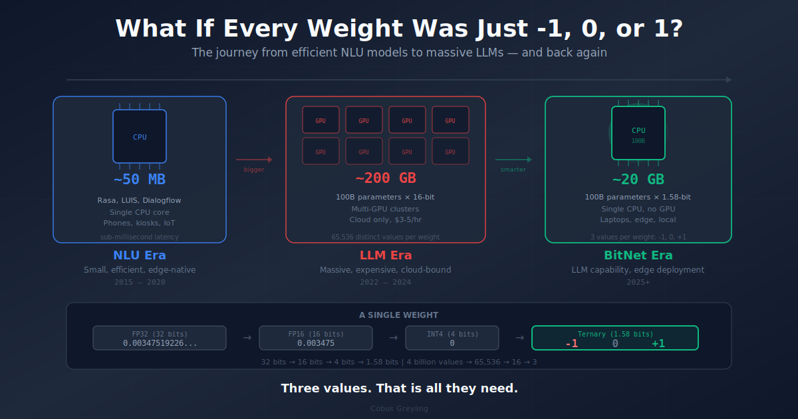

# BitNet Explorer



**Interactive visualization and benchmarking dashboard for Microsoft's BitNet — 1.58-bit LLM inference where every weight is just -1, 0, or 1.**

BitNet quantizes all neural network weights to three ternary values. A 100B parameter model compresses from ~200GB to ~20GB. Inference runs 2-6x faster on CPUs with 55-82% less energy. No GPU required.

This repo provides tools to explore, visualize, and interact with BitNet.

---

## What's Inside

| File | Description |
|------|-------------|
| `app.py` | Gradio GUI with 5 tabs: Weight Visualizer, Benchmarks, Quantization Explorer, API Client, Models & Setup |
| `bitnet_client.py` | Standalone CLI client for BitNet.cpp's OpenAI-compatible API (chat, streaming, model listing) |
| `setup-bitnet.sh` | One-command setup script that clones BitNet.cpp, downloads a model, compiles, and starts the server |
| `bitnet-blog.md` | Full blog post explaining BitNet technology |

---

## Quick Start

```bash
pip install -r requirements.txt
python3 app.py
```

No API keys needed. The visualizer, benchmarks, and quantization explorer all run locally with simulated data.

To connect the API Client tab to a real BitNet.cpp server:

```bash
# In a separate terminal, set up BitNet.cpp:
chmod +x setup-bitnet.sh
./setup-bitnet.sh
```

---

## Features

### 1. Weight Visualizer

Generates realistic FP16 transformer weight distributions and quantizes them to ternary {-1, 0, 1}. Shows side-by-side statistics, compression ratios, and ASCII histograms of how weight distributions change after quantization.

### 2. Benchmark Dashboard

Select any supported model (2B to 100B) and hardware platform (x86 AVX2/AVX512 or ARM NEON) to see:
- Memory comparison (FP16 vs ternary)
- Speed and energy benchmarks
- Cost projections for AI agent workloads (GPU vs CPU fleet)

### 3. Quantization Explorer

Slide from 1-bit to 32-bit and watch memory, compression, and arithmetic characteristics change in real time. Includes a reference table of standard bit widths (FP32, FP16, INT8, INT4, ternary, binary).

### 4. API Client

Chat with a running BitNet.cpp server directly from the GUI. The server exposes OpenAI-compatible endpoints — any code that talks to OpenAI works with BitNet.

### 5. Models & Setup

Complete reference of all supported models with parameters, sizes, and compression ratios. Includes setup instructions and quick-start commands.

---

## CLI Client

The standalone client supports interactive chat, single prompts, and streaming:

```bash
python3 bitnet_client.py                          # Interactive chat
python3 bitnet_client.py --prompt "Hello"         # Single prompt
python3 bitnet_client.py --url http://host:8080   # Custom server
python3 bitnet_client.py --stream                 # Streaming mode
python3 bitnet_client.py --models                 # List models
```

---

## Setup Script

One command to go from zero to a running BitNet.cpp server:

```bash
./setup-bitnet.sh                                           # Default: 3B model, port 8080
./setup-bitnet.sh microsoft/BitNet-b1.58-2B-4T i2_s 9090   # Custom model, port
```

The script:
1. Clones Microsoft's BitNet.cpp repository
2. Downloads and compiles the specified model with optimized kernels
3. Runs a test inference
4. Prints instructions for starting the API server

---

## Architecture

```
┌─────────────────────────────────────────────────────────┐
│                    BITNET EXPLORER                        │
│                                                          │
│  ┌──────────────┐  ┌──────────────┐  ┌──────────────┐  │
│  │   Weight      │  │  Benchmark   │  │ Quantization │  │
│  │  Visualizer   │  │  Dashboard   │  │  Explorer    │  │
│  │              │  │              │  │              │  │
│  │ FP16 vs      │  │ Speed/Memory │  │ 1-bit to     │  │
│  │ Ternary      │  │ /Cost/Energy │  │ 32-bit       │  │
│  └──────────────┘  └──────────────┘  └──────────────┘  │
│                                                          │
│  ┌──────────────┐  ┌──────────────┐                     │
│  │  API Client  │  │   Models &   │                     │
│  │              │  │    Setup     │                     │
│  │ Chat with    │  │              │                     │
│  │ BitNet.cpp   │  │ 8 supported  │                     │
│  │ server       │  │ models       │                     │
│  └──────┬───────┘  └──────────────┘                     │
│         │                                                │
│         ▼                                                │
│  ┌──────────────────────────────────────────────────┐   │
│  │           BitNet.cpp Server (local)               │   │
│  │     OpenAI-compatible API on localhost:8080        │   │
│  └──────────────────────────────────────────────────┘   │
└─────────────────────────────────────────────────────────┘
```

---

## Why This Matters

AI Agents make many LLM calls in sequence. When each call is 2-6x faster, a 10-step workflow that takes 60 seconds drops to 10-25 seconds. Energy consumption drops by 55-82%. And you can run it all on CPUs — no GPU clusters, no API rate limits, no per-token costs.

For enterprises running fleets of AI Agents, the cost equation changes entirely.

---

## Supported Models

| Model | Parameters | FP16 Size | BitNet Size | Compression |
|-------|-----------|-----------|-------------|-------------|
| BitNet b1.58-2B-4T | 2.4B | 4.8 GB | 0.5 GB | 9.6x |
| BitNet b1.58-3B | 3.3B | 6.6 GB | 0.7 GB | 9.4x |
| BitNet b1.58-Large | 0.7B | 1.4 GB | 0.15 GB | 9.3x |
| Llama3-8B-1.58 | 8B | 16 GB | 1.6 GB | 10x |
| Falcon3-1B-1.58 | 1B | 2 GB | 0.2 GB | 10x |
| Falcon3-3B-1.58 | 3B | 6 GB | 0.6 GB | 10x |
| Falcon3-7B-1.58 | 7B | 14 GB | 1.4 GB | 10x |
| Falcon3-10B-1.58 | 10B | 20 GB | 2 GB | 10x |

---

## License

MIT

---

## Author

Cobus Greyling
